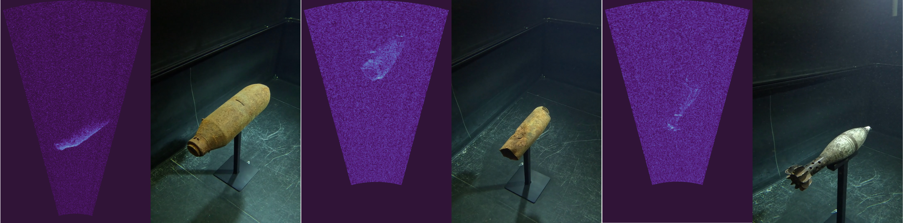
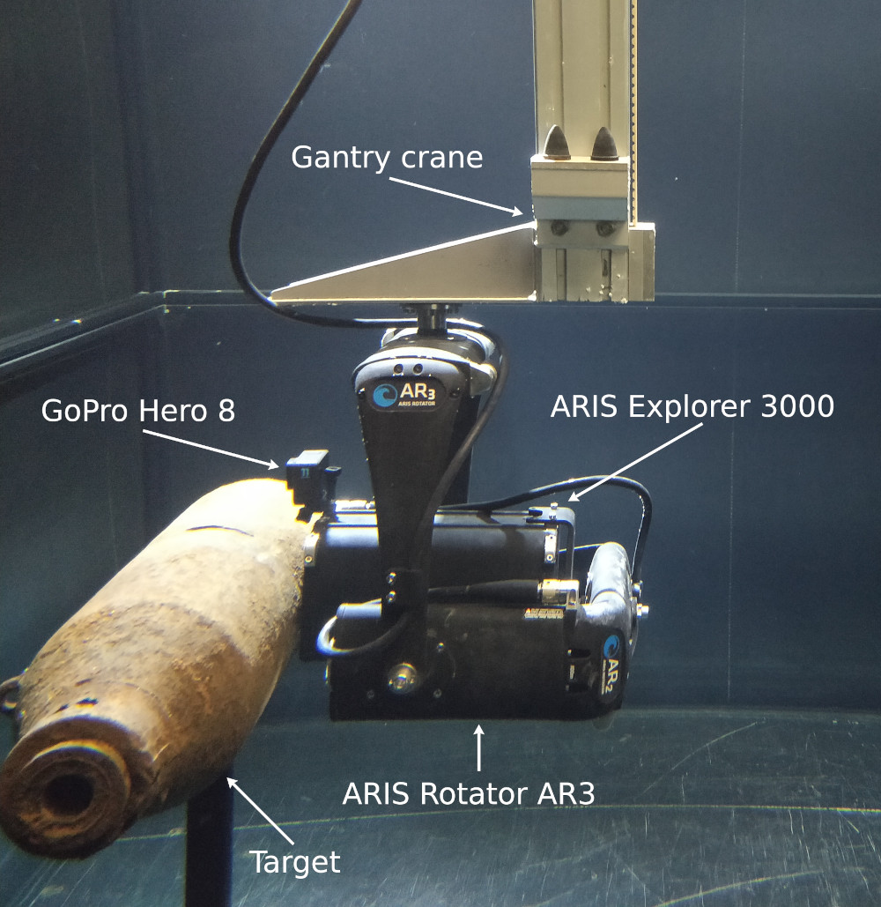

# About


During the 20st century, millions of tons of munition were dumped into the oceans worldwide. After decades of decay, the problems these unexploded ordnance (UXO) are causing are starting to become apparent. In order to facilitate more efficient salvage efforts through e.g. autonomous underwater vehicles, access to representative data is paramount. However, so far such data is not publicly available. 

We present a dataset of multimodal synchronized data for acoustic and optical sensing of UXO underwater. Using an ARIS 3000 imaging sonar, a GoPro Hero 8 and a custom design gantry crane, we recorded close to 100 trajectories and over 74,000 frames of 3 distinct types of UXO in a controlled environment. Included in this dataset are raw and polar transformed sonar frames, annotated camera frames, sonar and target poses, textured 3D models, calibration matrices, and more. It is intended for research of acoustic and optical perception of UXO underwater and was recorded in a controlled experimental environment. 



This dataset has the following properties:

 - Sonar scans of multiple UXO using an ARIS Explorer 3000 imaging sonar.
 - Matched GoPro UHD frames for most sonar frames.
 - Known and accurate transforms between sonar and targets.
 - Known details UXO targets including munition types, dimensions, and 3D models.
 - Tracked scan trajectories that are typical and achievable for non-experimental environments.
 - Publicly available at [https://zenodo.org/records/11068046].
 - Export scripts available at [https://github.com/dfki-ric/uxo-dataset2024].

This repository contains the code we used to prepare the raw recordings for export. A more in-depth description of the data can be found with the dataset itself and the accompanying [PAPER]().


# Citing
When using this dataset or the code used to process it, please cite the following paper:

```bibtex
@inproceedings{Dahn2024-uxo,
  title = {An Acoustic and Optical Dataset for the Perception of Underwater Unexploded Ordnance (UXO)},
  author = {Dahn, Nikolas and Bande Firvida, Miguel and Sharma, Proneet and Christensen, Leif and Geisler, Oliver and Mohrmann, Jochen and Frey, Torsten and Sanghamreddy, Prithvi Kumar and Kirchner, Frank},
  keywords = {UXO, unexploded ordnance, dataset, imaging sonar},
  booktitle = {2024 IEEE OCEANS}, 
  year = {2024},
  pages = {},
  doi = {},
  url = {},
}
```


# Code Overview

## Viewing the data
The exported data uses simple, well-established formats, namely .pgm, .jpg, .csv, .yaml, .json, and .txt. For convenience, we provide a script that loads an exported recording and allows to step through datapoints in a synchronized fashion using the arrow keys. To view a recording, use the following command:

```bash
python scripts/view_recording.py data_export/recordings/<target_type>/<recording-folder>
```


## Preprocessing
Reducing the dataset down to the (for us) relevant parts was subject to some challenges, largely due to oversights on our part. For one, the GoPro does not have a synchronized timestamp, so for us the best way to match the footage to the ARIS data was by matching the motion. In addition, the GoPro's recording and file naming scheme (combined with some dropouts due to low battery) made it difficult to find the corresponding clip for every recording. Calculating the optical flow has helped in these regards. The motion onset identified in the ARIS data was used to trim the other sensors after matching. In general, decisions were always made based on and in favor of the ARIS data.

To extract and prepare the data from the raw recordings, we used the scripts from this repository in filename order. Relevant options are documented in and read from the accompanying `config.yaml` file. The scripts used in particular are:

 - __prep_1_aris_extract.py__: extract individual frames as .pgm files and metadata as .csv from the ARIS recordings.
 - __prep_2_aris_to_polar.py__: convert the extracted ARIS data into other formats, namely polar-transformed .png images representing what the sonar was actually "seeing". Export into .csv point clouds is also possible.
 - __prep_3_aris_calc_optical_flow.py__: calculate the optical flow magnitudes for each ARIS recording, saved as .csv files.
 - __prep_4_aris_find_offsets.py__: graphical user interface to manually mark the motion onset and end for each ARIS recording.
 - __prep_5_gantry_extract.py__: extract the gantry crane trajectories as .csv files from the recorded ROS bags.
 - __prep_6_gantry_find_offsets.py__: automatically extracts the motion onsets and ends from each gantry crane trajectory.
 - __prep_7_gopro_cut.bash__: cut the GoPro recordings into clips according to the timestamps extracted from the audio tracks.
 - __prep_8_gopro_downsample.bash__: re-encode the previously cut GoPro clips into smaller resolutions.
 - __prep_9_gopro_calc_optical_flow.py__: calculate the GoPro clips' optical flow magnitudes, saved as .csv files.
 - __prep_x_match_recordings.py__: graphical user interface to pair ARIS recordings and GoPro clips and adjust the time offsets between them. Output is a .csv file.
 - __release_1_export.py__: assembles the dataset for export based on the previous preprocessing steps.
 - __release_2_archive.bash__: packs the preprocessed and exported files into archives.
 
 Further details and (some) documentation can be found in the scripts themselves. Since some of the packages interact with ROS1 (e.g. for extracting data from rosbags), you may have to setup an Ubuntu 20 docker container. As an alternative you may try [robostack](https://robostack.github.io/) to setup your ROS1 environment.
